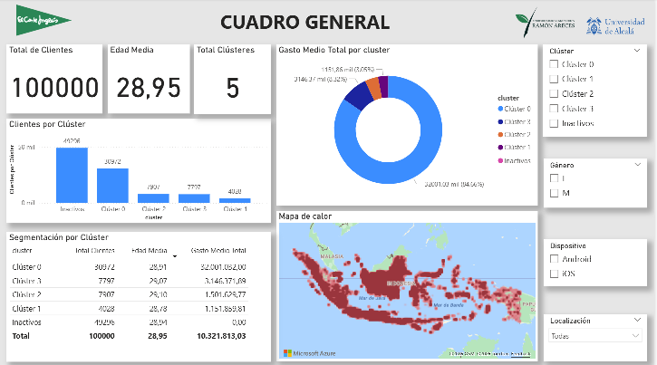
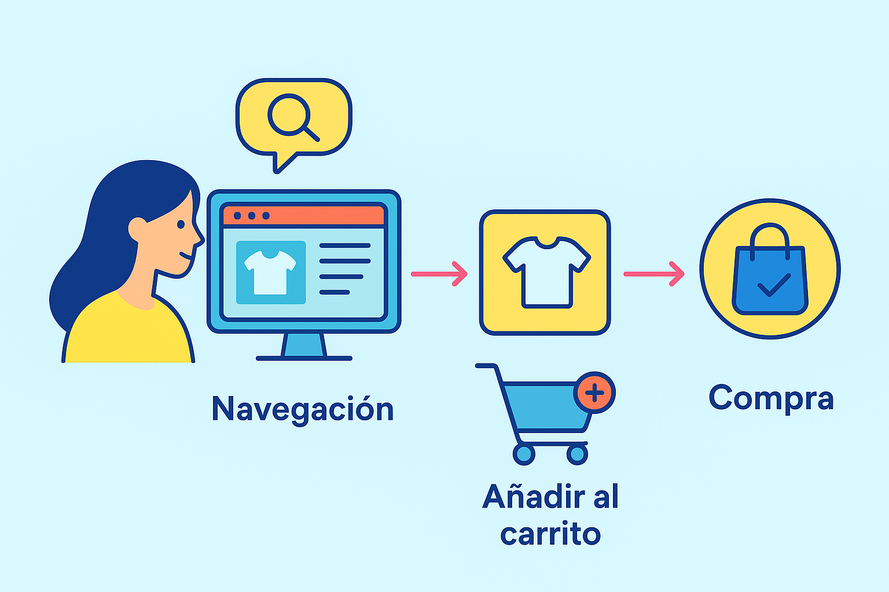
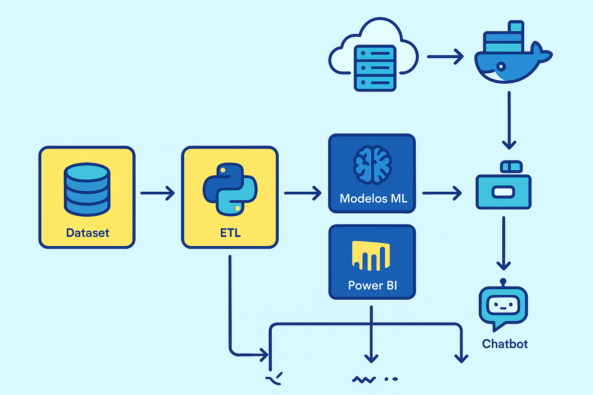
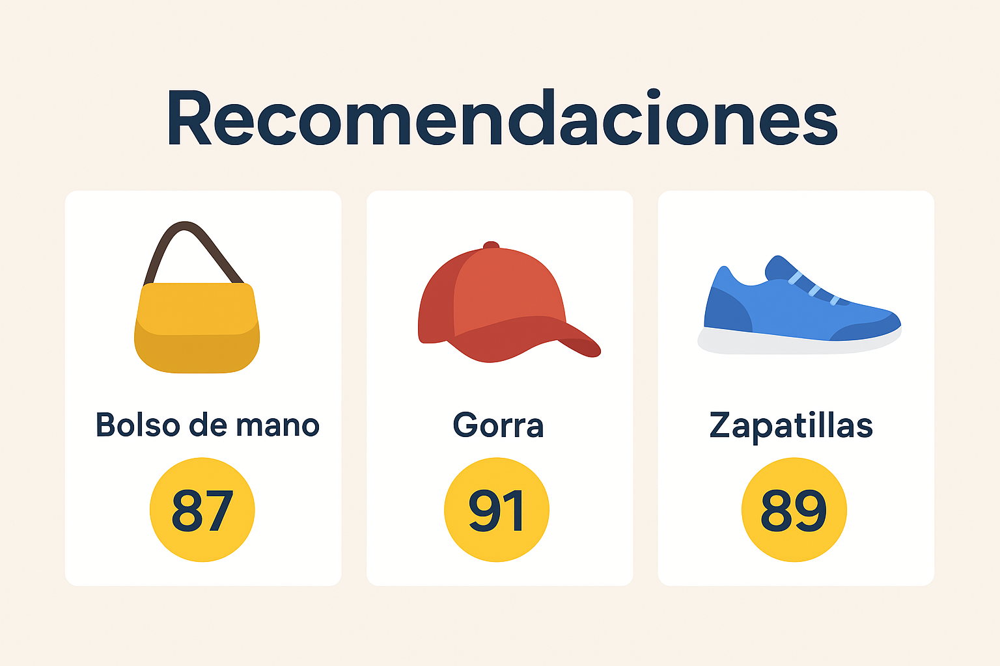

# 🛍️ TFM Retail Recommender

**Trabajo Fin de Máster – Máster en Analítica de Datos en Marketing Digital (UAH – CEURA)**

Sistema de recomendación y análisis predictivo de comportamiento del consumidor en retail.  
Desarrollado para optimizar estrategias de marketing y mejorar la experiencia de compra a través de datos históricos de navegación y transacciones.



---

## Tabla de contenidos
1. [Contexto](#contexto)
2. [Objetivos](#objetivos)
3. [Características principales](#características-principales)
4. [Arquitectura y tecnologías](#arquitectura-y-tecnologías)
5. [Instalación y uso](#instalación-y-uso)
6. [Estructura del repositorio](#estructura-del-repositorio)
7. [Resultados](#resultados)
8. [Autores](#autores)
9. [Licencia](#licencia)

---

## Contexto
En el sector retail, el análisis del comportamiento del consumidor es clave para personalizar la experiencia de compra, aumentar la conversión y optimizar campañas de marketing.  
Este proyecto analiza datos de un **dataset de transacciones de e-commerce** para extraer patrones de navegación y compra, segmentar clientes y ofrecer recomendaciones personalizadas.



---

## Objetivos
- Recomendación de productos basada en historial de compras y navegación.
- Segmentación de clientes mediante técnicas de clustering.
- Modelos predictivos para anticipar patrones de compra.
- Visualización de insights para la toma de decisiones estratégicas.
- Integración con herramientas de marketing para optimizar campañas.

---

## Características principales
- Sistema de recomendación híbrido (similaridad de productos y clientes).
- Segmentación por K-Means con variables de comportamiento y RFM.
- Análisis exploratorio (EDA) con detección de patrones y limpieza de datos.
- Dashboard en Power BI para visualización ejecutiva.
- Base de datos PostgreSQL con tablas unificadas para análisis y ML.
- Automatización de consultas y procesos ETL.
- Integración opcional con chatbot para recomendaciones conversacionales.

---

## Arquitectura y tecnologías
**Lenguajes y librerías:**
- Python 3.x  
  - Pandas, NumPy, Scikit-learn, Matplotlib, Seaborn  
  - Annoy (Approximate Nearest Neighbors)  
  - SQLAlchemy / psycopg2  
- SQL (PostgreSQL)  
- Power BI  

**Entorno:**
- Docker (opcional para despliegue)
- AWS (opcional para hosting de base de datos o aplicación web)

**Arquitectura:**


---

## Instalación y uso

### 1. Clonar el repositorio
```bash
git clone https://github.com/usuario/tfm-retail-recommender.git
cd tfm-retail-recommender
```

### 2. Crear entorno virtual e instalar dependencias
```bash
python -m venv venv
source venv/bin/activate   # Linux/Mac
venv\Scripts\activate      # Windows
pip install -r requirements.txt
```

### 3. Configurar variables de entorno

Crear archivo .env con:
```ini
DB_HOST=...
DB_NAME=...
DB_USER=...
DB_PASSWORD=...
```

### 4. Ejecutar scripts
```bash
python src/etl_pipeline.py
python src/train_recommender.py
```

## Estructura del repositorio
```bash
/data/              # Scripts o datasets (si se incluyen datos públicos)
/notebooks/         # Análisis EDA y modelado
/src/               # Código fuente del sistema (ETL, modelos, recomendaciones)
/powerbi/           # Archivos PBIX
/images/            # Imágenes usadas en el README
requirements.txt    # Dependencias Python
README.md           # Este archivo
```

## Resultados
- Modelos:
  - Silhouette score para clustering: 0.XX
  - Métricas de recomendación: precisión@k, recall@k, etc.

- Visualización:
  - Dashboard en Power BI con KPIs de clientes, ventas y recomendaciones.

- Ejemplo de recomendaciones para un cliente:


## Autores
- Antonio Andreu González – [email]
- Miguel Ángel Comino Matas – [email]
- Dolores Manchado Miguel – [email]
- Ana María Torres González – [email]

## Licencia
Este proyecto se distribuye bajo licencia MIT.
Consulta el archivo LICENSE para más información.
